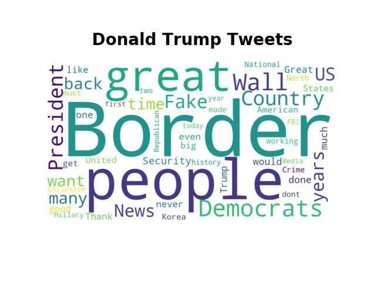
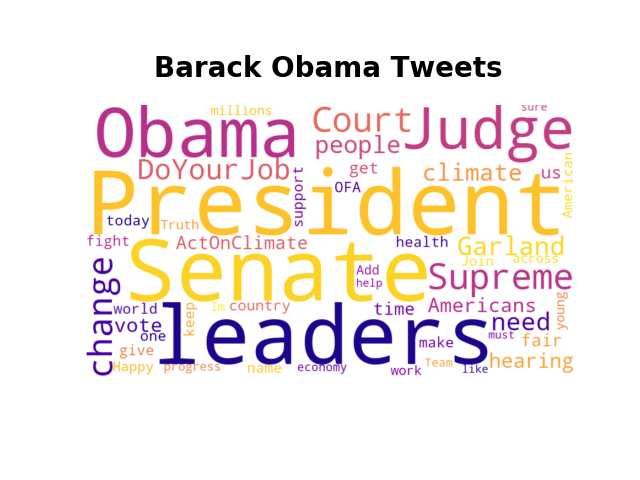

# Scraping Tweets from Presidential Twitter Accounts

Twitter was born in 2006, and Barack Obama was elected President in 2008.  President Obama and President Trump are the
first two presidents to utilize the social media platform during their presidencies. 

This code scrapes all of the recent tweets from the Twitter feeds of both President Trump and President Obama and visualizes the words
that most commonly appear in their respective tweets.

The tweets analyzed are those published by their own Twitter accounts and English stopwords as defined by the NLTK python package have been removed
before analyzing the most frequently occurring words.

